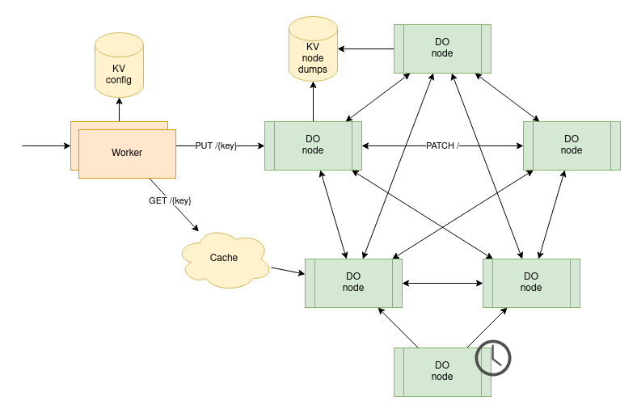
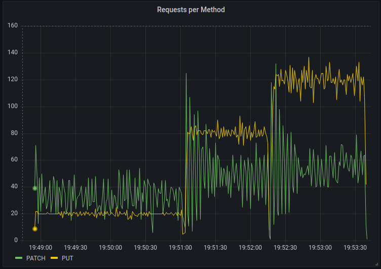
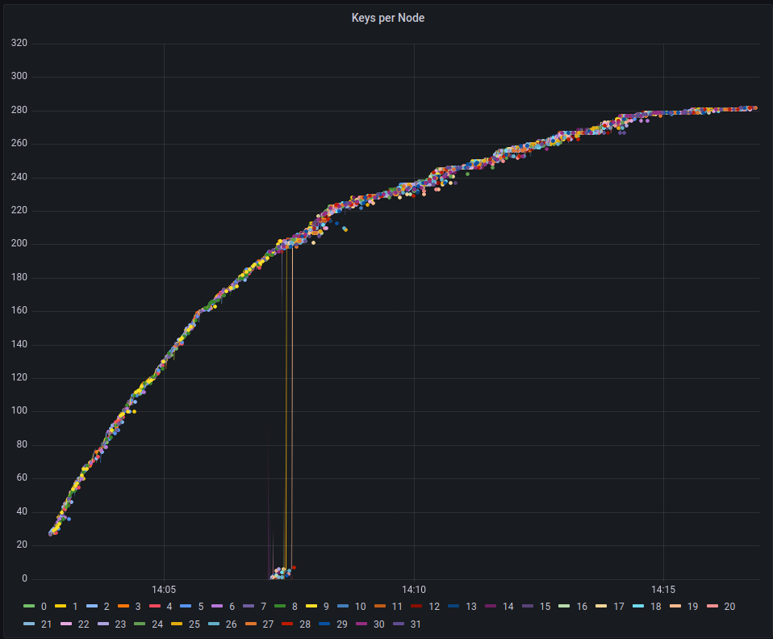

# Ring

This is a proof of concept for a LWW Register CRDT cluster running on Cloudflare Workers with Durable Objects.

Individual Durable Objects receive reads and writes for keys. Nodes gossip with each other to converge the LWW Register CRDT data structure.

Writes directed to the same node (bottleneck) based on the key so local timestamps can be used instead of a [logical clock](https://en.wikipedia.org/wiki/Logical_clock).

Reads are distributed based on the key and ip but should eventually see the current data by gossiping with the cluster.
Reads are also cached for a few seconds to reduce the load on the Durable Objects.

LWW(last-write-wins) Register is a type of [CRDT](https://en.wikipedia.org/wiki/Conflict-free_replicated_data_type) that uses the value with the latest timestamp to resolve conflicts.

The cluster spreads information through a [gossip protocol](https://en.wikipedia.org/wiki/Gossip_protocol) (dissemination) so each node can merge their local state with the remote state of other nodes.

https://www.desmos.com/calculator/bfqckelaxx

Gossip (`PATCH`) traffic will eventually reach a maximum with enough requests.

Gossip requests are rate-limited to prevent inter-cluster traffic from using all bandwidth. 

During constant traffic, the keys are replicated between nodes consistently.

(14:08:00 is when the number of nodes was increased from 10 to 32)

### TODO

- [ ] define types for
    - [x] config and default config
    - [x] env with namespaces
    - [ ] gossip message
    - [x] register
    - [x] registers
- [x] create functions to merge register and registers
- [x] handle GET and PUT on nodes with local registers state
- [x] handle ratelimited gossip and PATCH with flush
- [x] handle gossip on GET requests to keep node updated
- [x] optimize gossip with protocol buffer format
- [ ] optimize gossip by sending only new data
- [ ] find a better balance for gossiping during reads
- [ ] analyze total cluster request traffic to scale clusterSize dynamically
- [x] use logical clock instead of local clock for last write wins 
  - use version vector with each register to accept writes at any node (handle dynamic cluster size?)
  - resolve concurrent version vectors by using last written local timestamp (should use a better method of resolution)